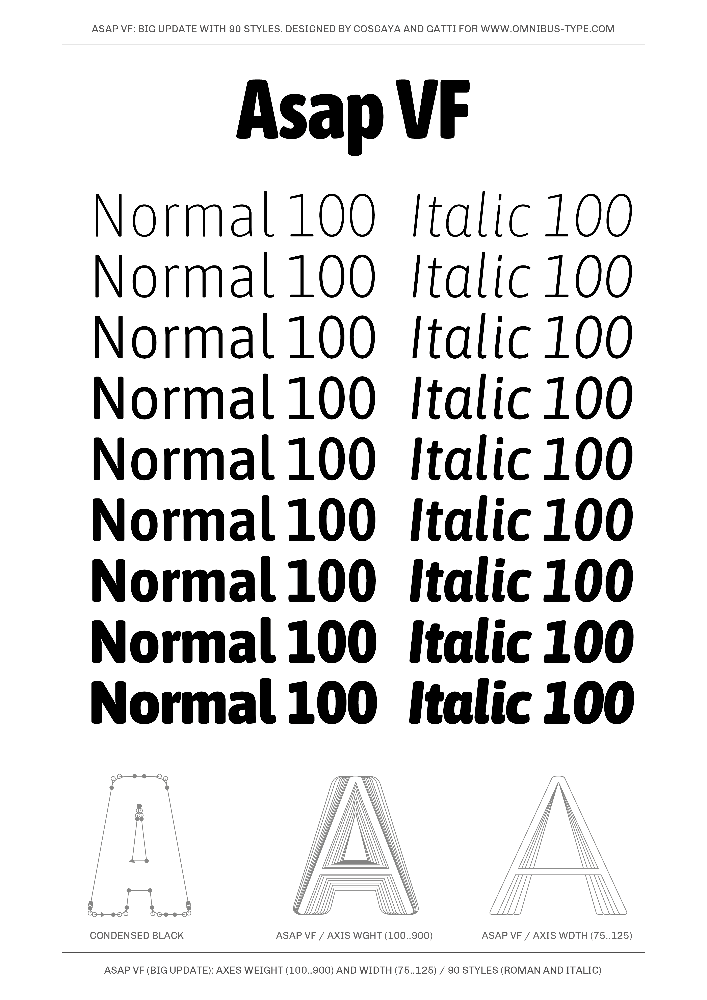
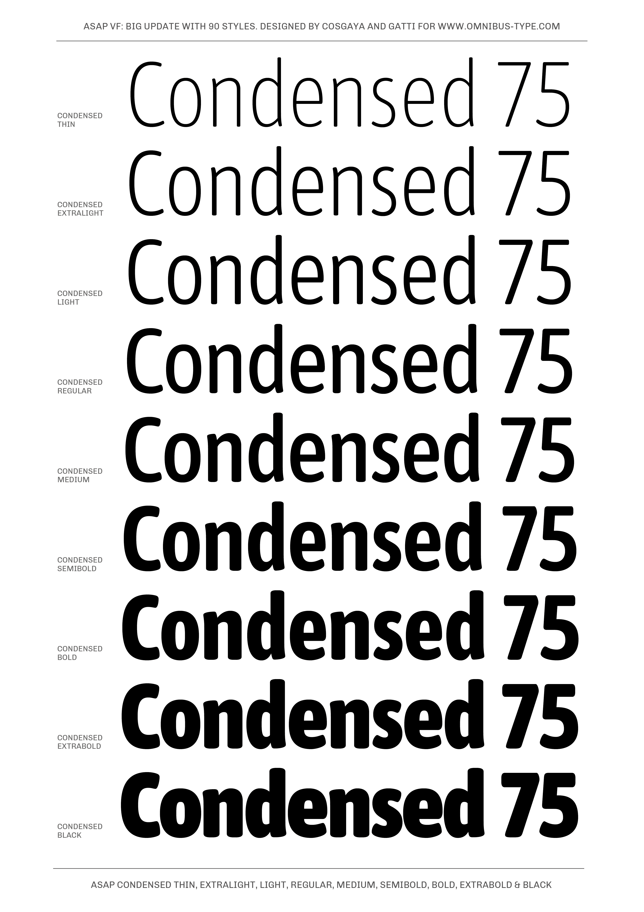
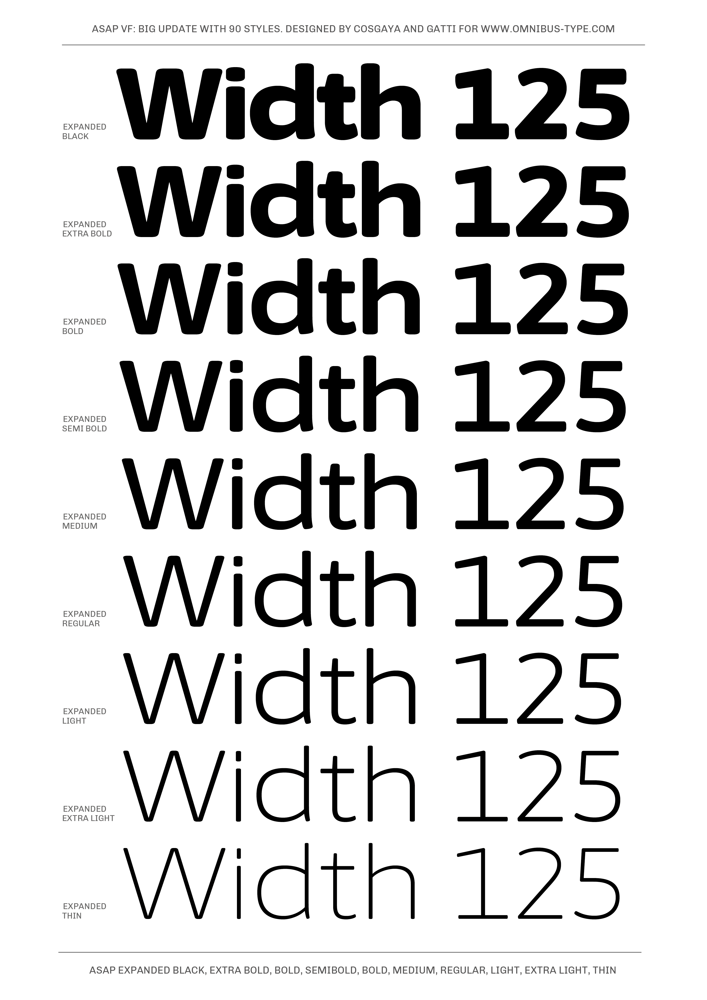

# Asap family

**Omnibus-Type**  
*SIL Open Font License, 1.1*

Asap is a contemporary sans-serif family with subtle rounded corners. Designed by Pablo Cosgaya, Asap ("as soon as possible") was specially developed for screen and desktop use, offers a standarised character width on all styles, which means lines of text remain the same length. This useful feature allows users to change type styles on-the-go without reflowing a text body. Asap is based on Ancha (designed by Pablo Cosgaya & Héctor Gatti), and has been developed with the collaboration of Eduardo Tunni, Andrés Torresi, Nicolás Silva and Yorlmar Campos.

####Asap family contains:

* Condensed Thin/Condensed Thin Italic
* Condensed ExtraLight/Condensed Extralight Italic
* Condensed Light/Condensed Light Italic
* Condensed Regular/Condensed Italic
* Condensed Medium/Condensed Medium Italic
* Condensed SemiBold/Condensed SemiBold Italic
* Condensed Bold/Condensed Bold Italic
* Condensed ExtraBold/Condensed ExtraBold Italic
* Condensed Black/Condensed Black Italic

* SemiCondensed Thin/SemiCondensed Thin Italic
* SemiCondensed ExtraLight/SemiCondensed Extralight Italic
* SemiCondensed Light/SemiCondensed Light Italic
* SemiCondensed Regular/SemiCondensed Italic
* SemiCondensed Medium/SemiCondensed Medium Italic
* SemiCondensed SemiBold/SemiCondensed SemiBold Italic
* SemiCondensed Bold/SemiCondensed Bold Italic
* SemiCondensed ExtraBold/SemiCondensed ExtraBold Italic
* SemiCondensed Black/SemiCondensed Black Italic

* Thin/Thin Italic
* ExtraLight/Extralight Italic
* Light/Light Italic
* Regular/Italic
* Medium/Medium Italic
* SemiBold/SemiBold Italic
* Bold/Bold Italic
* ExtraBold/ExtraBold Italic
* Black/Black Italic

* SemiExpanded Thin/SemiExpanded Thin Italic
* SemiExpanded ExtraLight/SemiExpanded Extralight Italic
* SemiExpanded Light/SemiExpanded Light Italic
* SemiExpanded Regular/SemiExpanded Italic
* SemiExpanded Medium/SemiExpanded Medium Italic
* SemiExpanded SemiBold/SemiExpanded SemiBold Italic
* SemiExpanded Bold/SemiExpanded Bold Italic
* SemiExpanded ExtraBold/SemiExpanded ExtraBold Italic
* SemiExpanded Black/SemiExpanded Black Italic

* Expanded Thin/Expanded Thin Italic
* Expanded ExtraLight/Expanded Extralight Italic
* Expanded Light/Expanded Light Italic
* Expanded Regular/Expanded Italic
* Expanded Medium/Expanded Medium Italic
* Expanded SemiBold/Expanded SemiBold Italic
* Expanded Bold/Expanded Bold Italic
* Expanded ExtraBold/Expanded ExtraBold Italic
* Expanded Black/Expanded Black Italic

To contribute to the project contact [Omnibus-Type](http://omnibus-type.com/).

### Designers

* Pablo Cosgaya

### License

Copyright 2021 Omnibus-Type (www.omnibus-type.com | omnibus.type@gmail.com)

Licensed under the [*SIL Open Font License, 1.1*](http://scripts.sil.org/OFL); you may not use this file except in compliance with the License.

======
## FONTLOG for the Asap fonts

This file provides detailed information on the Asap font software.  
This information should be distributed along with the Asap fonts and any derivative works.

### Asap is a typeface family that supports the following Unicode language range: 

* Basic Latin 			U+0020-U+007E
* Latin-1 Supplement 		U+00A0-U+00FF
* Latin Extended-A 		U+0100-U+017F
* Latin Extended Additional*	U+1E00-U+1EFF *(111/256)

**Character map to support MS Codepages:**
* 1252 Latin-1
* 1250 Latin-2 (Eastern Europe)
* 1254 Turkish
* 1257 Windows Baltic
* 1258 Vietnamese
* Mac Roman

*To contribute to the project contact Omnibus-Type at omnibus.type@gmail.com*

## Building

Fonts are built automatically by GitHub Actions - take a look in the "Actions" tab for the latest build.

If you particularly want to build fonts manually on your own computer, you will need to install the [`yq` utility](https://github.com/mikefarah/yq). On OS X with Homebrew, type `brew install yq`; on Linux, try `snap install yq`; if all else fails, try the instructions on the linked page.

Then:

* `make build` will produce font files.
* `make test` will run [FontBakery](https://github.com/googlefonts/fontbakery)'s quality assurance tests.
* `make proof` will generate HTML proof files.

======
## FONTLOG for the MuseoModerno fonts

This file provides detailed information on the Asap font software.  
This information should be distributed along with the Asap fonts and any derivative works.

**26 Aug 2022 (v.3.0) Omnibus-Type** 
- Big Update to Variable Font
- Axes weight (100..900) and width (75..125)

**12 Aug 2018 (v.2.0) Omnibus-Type** 
- Updated to GF Latin Plus set
- Supports 219 Latin languages used in 212 countries

**12 Aug 2018 (v.2.0) Omnibus-Type** 
- Updated to GF Latin Plus set
- Supports 219 Latin languages used in 212 countries

**05 Mar 2017 (v.1.9) Omnibus-Type**  
- Enabled Panose with correct values
- Enabled Family zoned
- Remmaped Medium weight
- Added Semibold Weight
- Enhancements in the OT shaping.

**08 Nov 2016 (v.1.8) Marc Foley**  
- Disabled Panose
- Disabled OpenTYpe name ID
- Adjusted vertical metrics to match v1.001

**02 Feb 2015 (v.1.7) Omnibus-Type**  
- Medium and MediumItalic new styles
- Removed Reserve Font Name from the license
- Name tables adjusted
- fsType Installable Mode
- Set Panose values
- Updates CFF and TTF hinting
- Added Family Alignment Zones
- New Verical Metrics

**17 Sep 2014 (v.1.6) Omnibus-Type**
- Set up PANOSE
- Fixed FullName string in the table names for Windows compatibility
- Improved the mark classes for mark positioning and mark to mark
- Improved CFF hint (AFDK AutoHinting v1.45, Mar 20 2014)
- Updating TTF instruction with ttfautohint (v1.1)

**1 Oct 2013 (v.1.5) Omnibus-Type**
- Expanded in order to support Adobe Latin 3 and vietnamite
- Updating hinting with ttfautohint (v0.97)
- Increased vertical metrics
- Improved CFF hint (AFDK 2.5.59)
- Improved TTF hint (TTFAutohint 0.95)
- Fixed TTF table names
- Updated and expanded features in OT Tables:
  - GSUB:
    * **aalt** Access All Alternatives
    * **ccmp** Glyph Composition/Decomposition
    * **locl** Localized Forms
    * **sups** SuperScript
    * **frac** Diagonal Fractions
    * **ordn** Ordinals
    * **liga** Standard Ligatures
    * **ss01** Style Set 1
    * **salt** Stylistic Alternatives
      * Single Substitution
      * Ligature Substitution
  - GPOS:
    * **mark** Mark Positioning
    * **mkmk** Mark to Mark
    * **cpsp** Capital Spacing

**19 Jan 2012 (v.1.001) Omnibus-Type**
- Initial release

### Acknowledgements

If you make modifications be sure to add your name (N), email (E), web-address
(if you have one) (W) and description (D). This list is in alphabetical order.

**N:** **Pablo Cosgaya**  
**E:** omnibus.type@gmail.com  
**W:** http://www.omnibus-type.com  
**D:** Designer

**N:** **Eduardo Tunni**  
**E:** omnibus.type@gmail.com 
**W:** http://www.omnibus-type.com  
**D:** Typeface development 

**N:** **Yorlmar Campos**  
**E:** omnibus.type@gmail.com 
**W:** http://www.omnibus-type.com  
**D:** Typeface development 

**N:** **Nicolás Silva**  
**E:** omnibus.type@gmail.com  
**W:** http://www.omnibus-type.com  
**D:** Typeface development 

**N:** **Andrés Torresi**  
**E:** omnibus.type@gmail.com  
**W:** http://www.omnibus-type.com  
**D:** Assistant Designer

**N:** **Héctor Gatti**  
**E:** omnibus.type@gmail.com  
**W:** http://www.omnibus-type.com  
**D:** Designer of Ancha upstream