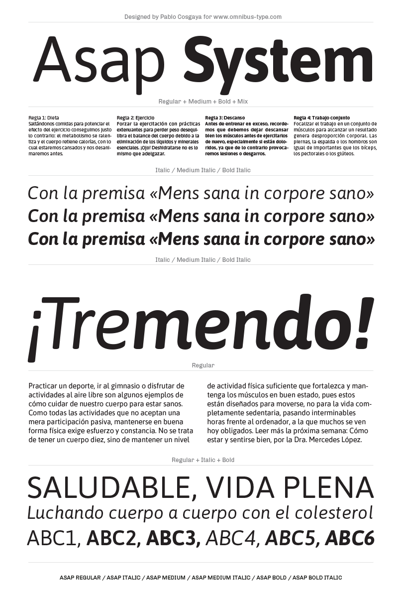

# Asap family

**Omnibus-Type**  
*SIL Open Font License, 1.1*

Asap is a contemporary sans-serif family with subtle rounded corners. Designed by Pablo Cosgaya, Asap ("as soon as possible") there are 4 styles: Regular, Italic, Bold and Bold Italic. This family, specially developed for screen and desktop use, offers a standarised character width on all styles, which means lines of text remain the same length. This useful feature allows users to change type styles on-the-go without reflowing a text body. Asap is based on Ancha (designed by Pablo Cosgaya & Hector Gatti), and has been developed with the collaboration of Andres Torresi and Nicolas Silva.

####Asap Family contains:
* Regular/Italic
* Medium/MediumItalic
* Bold/BoldItalic

To contribute to the project contact [Omnibus Type](http://omnibus-type.com/).

### Designers

* Pablo Cosgaya

### License

Copyright (c) 2011-2015, Omnibus-Type (www.omnibus-type.com omnibus.type@gmail.com)

Licensed under the [*SIL Open Font License, 1.1*](http://scripts.sil.org/OFL); you may not use this file except in compliance with the License.

======
## FONTLOG for the Asap fonts

This file provides detailed information on the Asap font software.  
This information should be distributed along with the Asap fonts and any derivative works.

### Asap is a typeface family that supports Unicode language range: 

* Basic Latin 				U+0020-U+007E
* Latin-1 Supplement 		U+00A0-U+00FF
* Latin Extended-A 			U+0100-U+017F
* Latin Extended Additional*	U+1E00-U+1EFF *(111/256)

**Character map to support MS Codepages:**
* 1252 Latin-1
* 1250 Latin-2 (Easter Europe)
* 1254 Turkish
* 1257 Windows Baltic
* 1258 Vietnamese
* Mac Roman

*To contribute to the project contact Omnibus-Type at omnibus.type@gmail.com*

**02 Feb 2015 (v.1.7) Omnibus-Type**  
- Medium and MediumItalic new styles
- Removed Reserve Font Name from the license
- Name tables adjusted
- fsType Installable Mode
- Set Panose values
- Updates CFF and TTF hinting
- Added Family Alignment Zones
- New Verical Metrics

**17 Sep 2014 (v.1.6) Omnibus-Type**
- Set up PANOSE
- Fixed FullName string in the table names for Windows compatibility
- Improved the mark classes for mark positioning and mark to mark
- Improved CFF hint (AFDK AutoHinting v1.45, Mar 20 2014)
- Updating TTF instruction with ttfautohint (v1.1)

**1 Oct 2013 (v.1.5) Omnibus-Type**
- Expanded in order to support Adobe Latin 3 and vietnamite
- Updating hinting with ttfautohint (v0.97)
- Increased vertical metrics
- Improved CFF hint (AFDK 2.5.59)
- Improved TTF hint (TTFAutohint 0.95)
- Fixed TTF table names
- Updated and expanded features in OT Tables:
  - GSUB:
    * **aalt** Access All Alternatives
    * **ccmp** Glyph Composition/Decomposition
    * **locl** Localized Forms
    * **sups** SuperScript
    * **frac** Diagonal Fractions
    * **ordn** Ordinals
    * **liga** Standar Ligatures
    * **ss01** Style Set 1
    * **salt** Stylistic Alternatives
      * Single Substitution
      * Ligature Substitution
  - GPOS:
    * **mark** Mark Positioning
    * **mkmk** Mark to Mark
    * **cpsp** Capital Spacing

**19 Jan 2012 (v.1.001) Omnibus-Type**
- Initial release

### Acknowledgements

If you make modifications be sure to add your name (N), email (E), web-address
(if you have one) (W) and description (D). This list is in alphabetical order.

**N:** **Andres Torresi**  
**E:** omnibus.type@gmail.com  
**W:** http://www.omnibus-type.com  
**D:** Assistant designer of Asap family  

**N:** **Hector Gatti**  
**E:** omnibus.type@gmail.com  
**W:** http://www.omnibus-type.com  
**D:** Designer of Ancha upstream  

**N:** **Nicolas Silva**  
**E:** omnibus.type@gmail.com  
**W:** http://www.omnibus-type.com  
**D:** Typeface development  

**N:** **Pablo Cosgaya**  
**E:** omnibus.type@gmail.com  
**W:** http://www.omnibus-type.com  
**D:** Designer